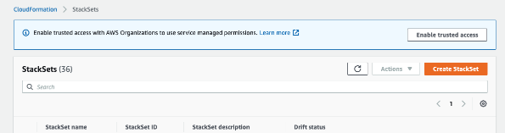
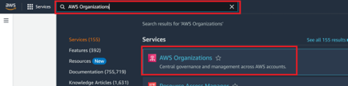
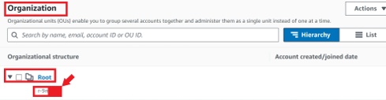
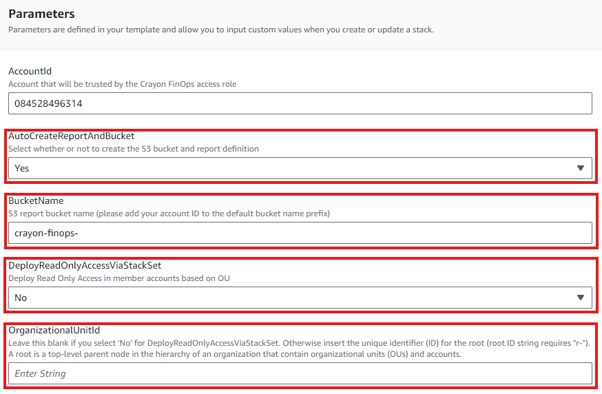
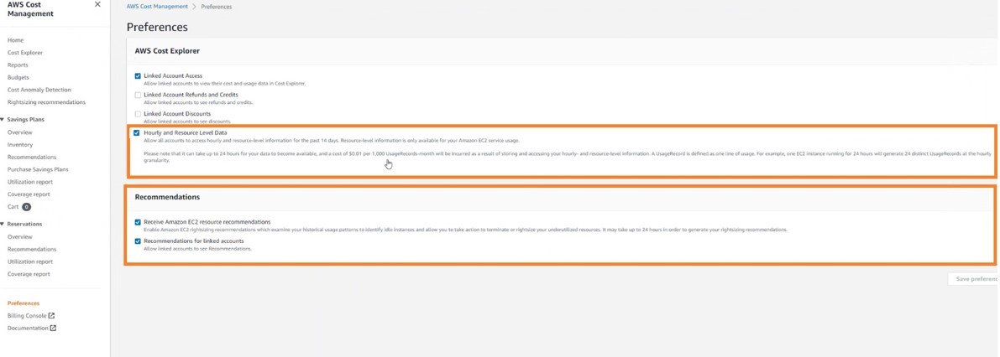

# AWS Cost Control Setup Using CloudFormation

## Table of Contents
- [Purpose](#purpose)
- [Prerequisites](#prerequisites)
- [Steps to Deploy CloudFormation](#steps-to-deploy-cloudformation)
  - [Use the Provided Link](#1-use-the-provided-link)
  - [Configure CloudFormation Parameters](#2-configure-cloudformation-parameters)
- [Enable Rightsizing Recommendations](#enable-rightsizing-recommendations)
- [Final Steps](#final-steps)
- [Conclusion](#conclusion)
- [Version Information](#version-information)

## Purpose
The primary goal is to enable **daily cost and usage reporting** as well as **optimization recommendations** by granting appropriate access across your infrastructure.

## Prerequisites
Before proceeding, ensure you have the following:
1.  **Role Required**
    Administrator of the Master account

## Steps to Deploy CloudFormation

### 1. Use the Provided Link
Click the following link to set up the AWS Cost Control:
- **[Link to Create CloudFormation](https://eu-west-1.console.aws.amazon.com/cloudformation/home?region=eu-west-1#/stacks/create/review?templateURL=https://crayondk-finops.s3-eu-central-1.amazonaws.com/CrayonFinOps.yml&stackName=CrayonFinOps&param_AccountId=084528496314&param_BucketName=crayon-finops-&param_AutoCreateReportAndBucket=Yes)**

### 2. Configure CloudFormation Parameters
<table style="width:100%;">
    <tr>
        <td style="width:50%; vertical-align: top;">

#### **AutoCreateReportAndBucket**
- **Select "No"** if:
  - You already have a bucket with a daily Cost and Usage Report.
  - You are a Crayon AWS customer.

- **Select "Yes"** if:
  - You do not have a bucket with daily cost and usage reports.

#### **BucketName**
- If **"No"** was selected for AutoCreateReportAndBucket, enter the name of your specific bucket.
- If **"Yes"** was selected, append your Account ID to the default bucket name prefix (`crayon-finops-XXXXXXXXXXXX`).

#### **DeployReadOnlyAccessViaStackSet**
This is required to read through the resources in each member account and identify any that are not being used.
- **Select "No"** if:
  - You do not want to deploy read-only access to member accounts.

- **Select "Yes"** if:
  - You want to deploy read-only access across all member accounts.
  - Ensure that CloudFormation StackSets are enabled, as described below.

  
 Click here if you selected "Yes" for DeployReadOnlyAccessViaStackSet. 

## Enable Trusted Access for StackSets (If DeployReadOnlyAccessViaStackSet is "Yes")
Follow the steps below to enable trusted access using AWS Console:
1. **Sign in** to AWS as the administrator fo the managment account.
2. Open the **AWS CloudFormation console**.
3. In the navigation pane, choose **StackSets**.
4. If trusted access is **disabled**, a banner displays the prompts to enable trusted access. click the **Enable trusted access** banner.

5. After successful enabling, a confirmation banner will appear.

#### **OrganizationUnitId**
- If **"No"** was selected for **DeployReadOnlyAccessViaStackSet**, leave this field **blank**.
- If **"Yes"** was selected, enter the unique identifier (ID) for the root organizational unit (e.g., `r-XXXX`). A root is a top-level parent node in the hierarchy of an organization that contain organizational units (OUs) and accounts.

  
 Step to Find AWS Root Account Id 

## Find AWS Root Account ID
To locate the root account ID:

1. Navigate to the top search bar and enter **AWS Organizations** And select **AWS Organizations** from the search results.

    

2. Within **Organizations**, you will find the **Root Account**. The root serves as the highest-level parent node in the organizational hierarchy, encompassing organizational units (OUs) and accounts.   

3. Directly beneath the root account, you'll find the unique identifier (ID) for the root, and it should follow the format `r-XXXX` as demonstrated. Use this value as **OrganizationalUnitId** in CloudFormation parameter.

    

</td>
<td style="width:50%; vertical-align: top;">

</td>
</tr>
</table>

## Enable Rightsizing Recommendations
You must enable **Rightsizing Recommendations** from the **Payer Account's** Cost Management Explorer preferences, as shown below. 

## Final Steps
Once the setup is complete, please send the following information to **finops.dk@crayon.com**:
1. Master Account Id
2. Bucket Name

## Conclusion
You have successfully completed the onboarding process for AWS Cost Control!

---

## Version Information
- **Version**: 1.0
- **Authors**: Suman Bhushal
- **Company**: Crayon

Feel free to reach out to the authors or the [Crayon DK FinOps Team](finops.dk@crayon.com) team for any assistance or feedback related to this.